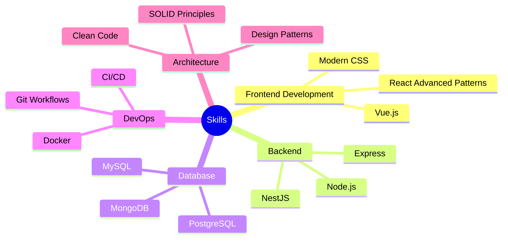

# <div align="center">🌟 Welcome to My Tech Universe 🌟</div>

<div align="center">
  
[](https://github.com/inevitable-ank)

</div>

<div align="center">
  <a href="https://git.io/typing-svg">
    
  </a>
</div>

<br/>


## 💫 About Me
```typescript
const ankit = {
    pronouns: "he" | "him",
    code: ["JavaScript", "TypeScript", "Python", "Java", "HTML", "CSS"],
    askMeAbout: ["web dev", "full stack", "react", "vue", "tech"],
    technologies: {
        frontend: ["React", "Vue", "HTML5", "CSS3", "JavaScript", "TypeScript"],
        backEnd: {
            js: ["Node.js", "Express", "NestJS"],
            python: ["Flask", "FastAPI"]
        },
        databases: ["PostgreSQL", "MongoDB", "MySQL"],
        devOps: ["Docker", "Git", "GitHub Actions", "CI/CD"]
    },
    currentFocus: "Building Scalable Web Applications",
    funFact: "Code is like humor. When you have to explain it, it's bad."
};
```

## 🌐 Let's Connect
<p align="left">
<a href="https://www.linkedin.com/in/ankit-kumar-ranjan-107244226"></a>
<a href="mailto:your-email@example.com"></a>
<a href="https://twitter.com/your_twitter"></a>
<a href="https://github.com/inevitable-ank"></a>
</p>

## 💻 Tech Stack

### Frontend Development


### Programming Languages


### Backend & APIs


### Database & DevOps


## 📊 GitHub Stats
<div align="center">
  
  
</div>

## 🏆 GitHub Trophies
<div align="center">
  
</div>

## 📈 Contribution Graph
[](https://github.com/ashutosh00710/github-readme-activity-graph)

## 🎯 Current Focus


## 🎨 Portfolio Projects
<div align="center">
  <a href="https://github.com/inevitable-ank/Schoolweb">
    
  </a>
  <a href="https://github.com/inevitable-ank/Birthday_card">
    
  </a>
  <a href="https://github.com/inevitable-ank/Record-meankit">
    
  </a>
  <a href="https://github.com/inevitable-ank/Online-Courses">
    
  </a>
</div>


<div align="center">
  
</div>


