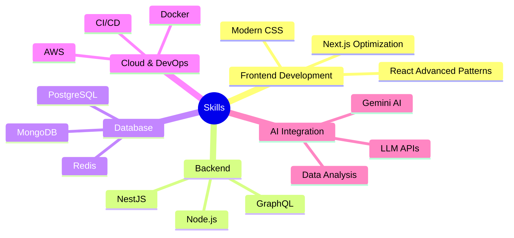

# <div align="center">🌟 Welcome to My Tech Universe 🌟</div>

<div align="center">
  
[](https://github.com/inevitable-ank)

</div>

<div align="center">
  <a href="https://git.io/typing-svg">
    
  </a>
</div>

<br/>


## 💫 About Me
```typescript
const ankit = {
    pronouns: "he" | "him",
    education: "B.Tech in Electronics & Telecommunication @ Army Institute of Technology",
    location: "Pune, India",
    code: ["JavaScript", "TypeScript", "Python", "Java", "C++", "Golang", "Dart"],
    askMeAbout: ["full stack development", "react", "node.js", "system design", "startups"],
    technologies: {
        frontend: ["React", "Next.js", "HTML5", "CSS3", "Tailwind CSS", "Flutter"],
        backEnd: {
            js: ["Node.js", "Express", "NestJS", "GraphQL"],
            python: ["FastAPI", "Data Analysis"]
        },
        databases: ["PostgreSQL", "MongoDB", "MySQL", "Redis", "BigQuery"],
        cloud: ["AWS", "Docker", "CloudFront", "S3"],
        tools: ["Git", "Figma", "Jest", "Swagger", "Postman"]
    },
    currentFocus: "Building Scalable Full-Stack Applications & AI Integration",
    achievements: [
        "Top 5% in JEE Advanced",
        "100+ DSA problems solved",
        "Led 5+ startup events for 300+ entrepreneurs",
        "Built apps serving 100+ users"
    ],
    funFact: "Transformed a simple idea into a platform serving 1600+ students across India! 🚀"
};
```

## 🌐 Let's Connect
<p align="left">
<a href="https://www.linkedin.com/in/ankit-kumar-ranjan-107244226"></a>
<a href="mailto:inevitableank@gmail.com"></a>
<a href="https://github.com/inevitable-ank"></a>
</p>

## 💻 Tech Stack

### Frontend Development


### Programming Languages


### Backend & APIs


### Database & DevOps


## 📊 GitHub Stats
<div align="center">
  
  
</div>

## 🏆 GitHub Trophies
<div align="center">
  
</div>

## 📈 Contribution Graph
[](https://github.com/ashutosh00710/github-readme-activity-graph)

## 🎯 Current Focus


## 🎨 Portfolio Projects

<div align="center">
  <a href="https://github.com/inevitable-ank/MentalEase">
    
  </a>
  <a href="https://github.com/inevitable-ank/StartupSaga">
    
  </a>
  <a href="https://github.com/inevitable-ank/DiabetesCare">
    
  </a>
  <a href="https://github.com/inevitable-ank/Schoolweb">
    
  </a>
</div>

### 🚀 Project Highlights

<div align="center">

| 🧠 **MentalEase** | 🎯 **StartupSaga** |
|:---:|:---:|
| **100+ Users** | **1600+ Students** |
| AI-Powered Mental Health | Pan-India Event Portal |
| React.js • Node.js • MongoDB • Gemini AI | React.js • Real-time Updates • Figma |

| 🩺 **DiabetesCare** | 🏫 **Schoolweb** |
|:---:|:---:|
| **150+ Patients** | **Educational Platform** |
| AI Health Management | School Management System |
| React.js • Node.js • Gemini AI • Drizzle ORM | Modern Web Technologies |

</div>


<div align="center">
  
</div>


