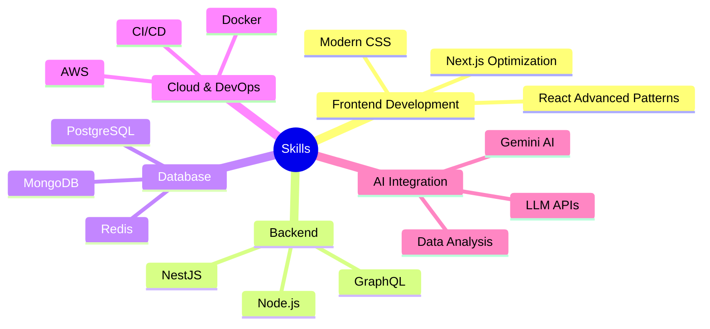

# <div align="center">🌟 Welcome to My Tech Universe 🌟</div>

<div align="center">
  
[](https://github.com/inevitable-ank)

</div>

<div align="center">
  <a href="https://git.io/typing-svg">
    
  </a>
</div>

<br/>


## 💫 About Me
```typescript
const ankit = {
    pronouns: "he" | "him",
    education: "B.Tech in Electronics & Telecommunication @ Army Institute of Technology",
    location: "Pune, India",
    code: ["JavaScript", "TypeScript", "Python", "Java", "C++", "Golang", "Dart"],
    askMeAbout: ["full stack development", "react", "node.js", "system design", "startups"],
    technologies: {
        frontend: ["React", "Next.js", "HTML5", "CSS3", "Tailwind CSS", "Flutter"],
        backEnd: {
            js: ["Node.js", "Express", "NestJS", "GraphQL"],
            python: ["FastAPI", "Data Analysis"]
        },
        databases: ["PostgreSQL", "MongoDB", "MySQL", "Redis", "BigQuery"],
        cloud: ["AWS", "Docker", "CloudFront", "S3"],
        tools: ["Git", "Figma", "Jest", "Swagger", "Postman"]
    },
    currentFocus: "Building Scalable Full-Stack Applications & AI Integration",
    achievements: [
        "Top 5% in JEE Advanced",
        "100+ DSA problems solved",
        "Led 5+ startup events for 300+ entrepreneurs",
        "Built apps serving 100+ users"
    ],
    funFact: "Transformed a simple idea into a platform serving 1600+ students across India! 🚀"
};
```

## 🌐 Let's Connect
<p align="left">
<a href="https://www.linkedin.com/in/ankit-kumar-ranjan-107244226"></a>
<a href="mailto:inevitableank@gmail.com"></a>
<a href="https://github.com/inevitable-ank"></a>
</p>

## 💻 Tech Stack

### Frontend Development


### Programming Languages


### Backend & APIs


### Database & DevOps


## 📊 GitHub Stats
<div align="center">
  
  
</div>

## 🏆 GitHub Trophies
<div align="center">
  
</div>

## 📈 Contribution Graph
[](https://github.com/ashutosh00710/github-readme-activity-graph)

## 💼 Professional Experience

### 🏢 Citadel - Full Stack Intern (Oct 2021 - Present)
**Technologies:** React.js, Node.js, TypeScript, PostgreSQL, AWS, Docker, Redis, CloudFront
- **Led full-stack implementation:** Built OTP onboarding, S3 profile storage, and adjective-based matching system
- **Real-time chat system:** Implemented low-latency chat with Socket.IO and Redis, including typing indicators and read receipts
- **Payment integration:** Integrated PhonePe Gateway for secure event payments and booking workflows
- **Performance optimization:** Boosted UX with reusable Tailwind/Radix components, code-splitting, and React Query caching

### 🏢 Hydyko Technologies - Full Stack Intern (Jan 2025 - July 2025)
**Technologies:** NestJS, React.js, Next.js, Antd, ShadCN, TypeScript, PostgreSQL, BigQuery
- **Performance gains:** Slashed client-side bundle size by 30% and accelerated load times by 25%
- **Data pipeline automation:** Built ETL pipelines with BigQuery integration, cutting API latency
- **Interactive dashboards:** Delivered visualizations that improved decision-making by 28%
- **Security & documentation:** Enforced RBAC, validated endpoints via Swagger, improved onboarding by 50%

### 🏢 Zafo.ai - Software Developer Intern (Dec 2024 - Jan 2025)
**Technologies:** Next.js, Tailwind CSS, Node.js, MongoDB
- **Landing page development:** Created responsive React-based site, boosting conversion rates by 40%
- **TDD implementation:** Achieved 95% test coverage, reducing production bugs by 30%
- **AI integration:** Built LLM-powered APIs for social media automation, increasing engagement by 40%

## 🎯 Current Focus


## 🚀 Featured Projects

### 🧠 MentalEase - AI-Powered Mental Health Platform
**Tech Stack:** React.js, Node.js, Express.js, MongoDB, Gemini AI, Tailwind CSS
- Built a comprehensive mental health app serving **100+ users**
- Implemented mood tracking, AI therapy sessions, and anonymous sharing features
- Integrated secure authentication and interactive quizzes for mental wellness

### 🎯 StartupSaga - Pan-India Event Portal  
**Tech Stack:** React.js, HTML, CSS, JavaScript, Figma
- Launched a nationwide event platform serving **1600+ students**
- Implemented real-time registration and live updates
- Designed responsive UI with seamless user experience

### 🩺 DiabetesCare - AI Health Management
**Tech Stack:** React.js, Node.js, Gemini AI, Drizzle ORM, Privy
- Developed AI-powered diabetes management for **150+ patients**
- Features report scanning, schedule management via Kanban boards
- Implemented secure Privy authentication and responsive UI

### 🏆 Hackathon Achievements
- **HackFormers Terna COE:** Top 5 out of 50+ teams - Built real-time collaboration tool
- **INNERVE:** "Best Front-End Team" - 30% improvement in usability scores
- **DSA Mastery:** 100+ algorithm challenges solved on LeetCode & GeeksforGeeks

## 🎨 Portfolio Projects
<div align="center">
  <a href="https://github.com/inevitable-ank/Schoolweb">
    
  </a>
  <a href="https://github.com/inevitable-ank/Birthday_card">
    
  </a>
  <a href="https://github.com/inevitable-ank/Record-meankit">
    
  </a>
  <a href="https://github.com/inevitable-ank/Online-Courses">
    
  </a>
</div>


<div align="center">
  
</div>


